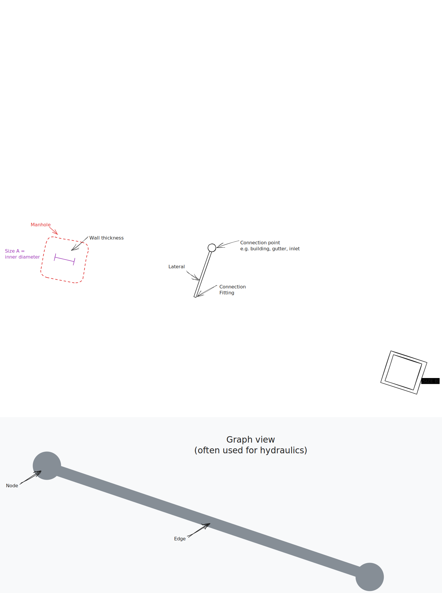

# Disclaimer

**WARNING: THIS IS AN EXPERIMENTAL PROJECT**

# Scope

The aim of this project is to accomplish the following tasks:

- Extract information from an ISYBAU-XML file.
- Utilize [IfcOpenShell](https://ifcopenshell.org/) to generate geometry based on the extracted data, initially focusing on precast/standardized elements.
- Map the data to the [IFC-Schema 4x3](https://standards.buildingsmart.org/IFC/RELEASE/IFC4_3/).

# ISYBAU

The German [ISYBAU](https://www.bfr-abwasser.de/html/A7ISYBAU_ATF_XML.html) wastewater exchange formats facilitate standardized, XML-based data exchange of sewer data between clients (e.g., State Building Management), contractors (e.g., engineering offices), or other project participants (e.g., surveying engineering offices or inspection companies).

The standard is well-documented, and [real-world examples](https://www.bfr-abwasser.de/html/Materialien.1.40.html) are available, which will serve as references during implementation.

# Roadmap

- [x] Remove xlsx import as it's not standardized and was only part of the early POC.
- [ ] Develop custom classes to encapsulate all relevant information from isybau:
  - [ ] Identify pertinent data structures (e.g., project, manhole, reach, lateral, "Bauwerk"...).
  - [ ] Create a parser for each data structure that accepts the corresponding XML element as input.
  - [ ] Populate the data structure with retrieved information. Consider including a simple dictionary with all available values to facilitate custom Property Set (pset) creation later.
  - [ ] Determine a strategy for handling nested data.
- [ ] Generate IFC elements based on the defined data structures. Initially, focus on populating these elements with data rather than representing them visually, but include a custom pset containing all available information.
- [ ] Attempt to map as much data as feasible to the relevant native IFC attributes.
- [ ] Develop a functionality akin to the [shape builder](src/ifcopenshell-python/ifcopenshell/util/shape_builder.py) that utilizes the defined data structures and IFC elements to incorporate representations.

# Terms and Definitions

